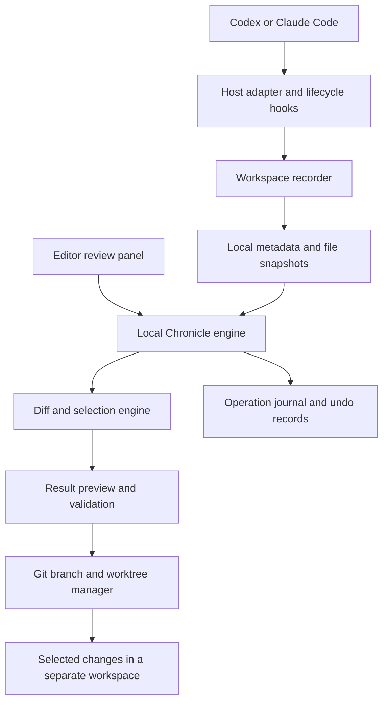

# Chronicle architecture

Status: implementation reference plus proposed target architecture. The local engine, CLI, VS Code panel, Claude/Codex hook payload adapters, and schema-1 adapter-event evidence contract exist at fixture-tested scope. See [RELEASE_AUDIT.md](RELEASE_AUDIT.md) for current evidence. Real host validation, automatic operation resumption, and environment replay remain incomplete; guarded output undo and within-hunk change-group selection are implemented but still need real-host validation. Proposed upgrades and their order are in [upgrades.md](upgrades.md); research findings and their limits are in [learnings.md](learnings.md).

## Implemented slice

The optional overnight development runner is separate from Chronicle's product runtime. Codex edits tracked files and runs project tests in a network-disabled `workspace-write` sandbox, where Git metadata is read-only. The trusted Windows supervisor checks the resulting worktree and sandboxed test events without executing model-edited project code, commits one validated tracked-file change set, and normally pushes to the authorized origin. New, deleted, staged, protected-control-file, or failed results stop for manual recovery; this automation does not make Chronicle's recorder an always-on service. See [ORCHESTRATION.md](ORCHESTRATION.md).

- `src/engine.js`: byte-hashed UTF-8 snapshots, checkpoint diffs, whole-hunk and within-hunk change-group selection, result previews, separate Git worktree output, and operation journals.
- `src/cli.js`: direct local commands with no model requests.
- `src/extension.js`: VS Code commands and webviews for selection/preview/branch output and read-only side-by-side comparison of two completed operation manifests. Comparison rendering escapes stored values and disables scripts; it does not run checks or agents.
- `src/hook.js` and `hooks/hooks.json`: Claude session/tool-boundary adapter, including failure events. `plugin.json` and `hooks/codex-hooks.json` configure a Codex CLI lifecycle adapter using supported `SessionStart`, `SessionEnd`, `Interrupt`, `PreToolUse`, and `PostToolUse` events. Codex has no distinct post-tool-failure hook in the current event docs; its post-tool event is recorded as observed, not assumed successful. Both adapters are fixture-tested; real host sessions remain unverified.
- `scripts/demo.js`: keeps 40 of 80 edits in a disposable fixture.

Hook capture failures produce sanitized, bounded local gap records visible through the CLI and checkpoint comparison. Raw prompts, commands, tool errors, and repository paths are not stored in these records. A 1,000-event cap produces an explicit limit marker.

The prototype uses CommonJS JavaScript and atomic JSON metadata to avoid build and native database dependencies. TypeScript, SQLite, and React below remain target choices, not installed dependencies. See [D007](DECISIONS.md#d007--dependency-free-first-slice) and [run instructions](GETTING_STARTED.md).

Storage recovery quarantines interrupted temporary files and reports unfinished branch journals without deleting their contents. The `reconcile` command compares operation journals against registered worktrees and local branch refs, reports interrupted or missing output, and checks completed file hashes for later edits. It accounts for the intended uncommitted output so normal Git-dirty status is not mistaken for later edits; it never changes workspaces. `undo <operation-id>` restores only the selected paths in Chronicle's output worktree, after checking their bytes and modes against Chronicle's result or (when resuming an interrupted undo) the saved baseline. It refuses staged selected paths, later commits, and unexpected edits; the branch and worktree remain. Dead-owner locks require an explicit flag and are archived; live or unreadable locks are preserved. Automatic operation resumption remains incomplete. Snapshots are captured at observed boundaries, with a two-pass stability check rather than a filesystem-wide atomic snapshot. Branch output rejects checkpoints with reported exclusions. Git-ignored files are outside capture coverage. Existing staged entries are recorded as evidence, but staging intent is not recreated in the output worktree.

Completed operations also contain a schema-1 evidence manifest: source checkpoint IDs, baseline commit, selected change IDs, result checkpoint's observed host/attribution labels, gap/exclusion counts, measured Node/platform/architecture, and saved output hashes/modes. The CLI's `compare-operations` and VS Code's **Chronicle: Compare Saved Branches** compare two completed manifests and label each path added, deleted, changed, or identical. This is a deterministic saved-file comparison; it does not rerun checks or agent work. `record-check` appends a developer-reported check label, timestamp, exit code, and reported outcome to a completed operation; it does not execute or independently verify the named check. Checks remain empty until explicitly reported, and cost is unavailable (`null`). No test pass or zero cost should be inferred.

## 1. What we are building first

Chronicle is an open-source, local-first companion for coding agents. It records workspace changes, shows where they came from, and lets a developer keep selected changes without asking the model to generate them again.

The first demonstration is simple: an agent changes 80 lines in a README. The developer reviews the diff, selects the changes they want, previews the resulting document, and applies that selection to a separate branch. Chronicle makes no model request during this flow.

Selection is based on changes, not a promise that any arbitrary 40 lines form a valid result. A replacement can involve both removed and added lines; code changes may depend on other changes.

The original concept included broader environment replay. The current [README](README.md) and this architecture narrow the first release to file history, selective application, and branch comparison. Browser replay and restarting an agent from its internal state are later projects.

## 2. Where the product lives

The user stays in their coding workflow. A separate hosted website is not required.

There are three parts:

1. **Agent integration:** a host-specific plugin or adapter records supported lifecycle events.
2. **Review interface:** an editor panel shows checkpoints, diffs, selections, and branches.
3. **Local engine:** records files and performs Git operations without calling a model.

For the first rich interface, use a VS Code extension with a webview beside the agent. This is Chronicle's editor panel; it does not require modifying the vendor's own interface. VS Code documents [webview views and panels](https://code.visualstudio.com/api/extension-guides/webview).

Codex supports plugin packaging and local hooks, but each host's available events and UI must be verified. The official MCP UI quickstart describes tools for ChatGPT and Codex, with an optional iframe component inside ChatGPT. That is not sufficient evidence that the same custom panel can be embedded in Codex Desktop. See [Codex plugin packaging](https://developers.openai.com/plugins/build/plugins), [Codex hook events](https://developers.openai.com/codex/hooks/), and the [MCP app quickstart](https://developers.openai.com/plugins/build/app-quickstart).

Claude Code provides events such as `PreToolUse`, `PostToolUse`, and `PostToolUseFailure`. Its documentation defines the latter as a tool execution failure and the former post-event as successful completion. Codex's configured local hook set provides pre/post observations but no separate post-tool-failure boundary in the current adapter. These are useful recording boundaries, subject to actual host behavior. See [Claude Code hooks](https://code.claude.com/docs/en/hooks) and [Codex hook events](https://developers.openai.com/codex/hooks/).

The feasibility milestone must choose one supported agent/editor combination. Do not advertise identical integration across every Codex and Claude surface.

## 3. Component overview

The review panel talks directly to the local engine. Selecting changes must not require sending a chat message to the agent.

The external host is an event source, not a state snapshot. A hook tells Chronicle that a host boundary occurred; it does not by itself prove exclusive authorship, reveal hidden reasoning, or establish that every file/tool event was seen. Mark event status according to what that host actually reports, and retain explicit capture gaps.

## 4. Recommended stack

| Layer | Initial choice | Reason |
| --- | --- | --- |
| Local engine | TypeScript on Node.js | Shares types with the editor extension and plugin adapters |
| Review interface | VS Code extension, React webview | Fits the coding workflow and supports a custom diff review UI |
| Metadata | SQLite | Local persistence for sessions, events, checkpoints, and recovery |
| File snapshots | Content-addressed blobs | Store identical file contents once and verify them by hash |
| Branch operations | Installed Git, invoked with argument arrays | Use established worktree and patch behavior |
| UI-to-engine transport | Extension-host messaging | Avoid a public listening server for the first version |
| External hook transport | Per-user local IPC | Connect hook processes to the recorder with restricted access |

Use one long-lived local engine per workspace initially. Serialize Chronicle mutations for that workspace. A local lock does not prevent another editor or process from changing files, so content checks remain necessary.

A general agent framework, cloud backend, and vector database are not needed for this first release.

## 5. Recorder and checkpoints

A **checkpoint** is a saved view of supported workspace files at a particular boundary. It is not a snapshot of the model's hidden reasoning or the entire operating system.

At session start, record:

- Repository identity, current commit, and branch.
- Effective file contents, including supported staged and unstaged changes.
- The original index state separately from working-tree contents.
- Capture rules, excluded paths, and adapter capabilities.

Pre-existing changes are part of the baseline. They must never be labeled as agent changes merely because the repository was already dirty.

At supported boundaries, save before and after file states and attach available event metadata: tool name, timestamp, result status, and host event identifier. Record after failed tools too, because a command can change a file before failing.

Hooks do not necessarily observe every read, write, or instruction. A file watcher can detect changes, but cannot reliably prove whether an agent, developer, formatter, or background process caused them. Mark uncertain attribution and capture gaps visibly. Concurrent actions may share a checkpoint interval; do not invent an exact sequence.

Only saved on-disk contents are captured initially. Unsaved editor buffers are outside the snapshot unless a later explicit integration handles them.

### Storage rules

Store metadata and blobs in a per-user application-data directory, keyed by repository identity. Resolve existing storage-base and repository-specific store symlinks before creating subdirectories, and reject any canonical final path inside the recorded repository. A dangling final store symlink is refused. Existing internal store entries (`blobs`, `checkpoints`, `operations`, `worktrees`, `gaps`, and `recovery`) must be real directories; symlinks and non-directory entries are rejected before any of those children are created.

Each checkpoint references immutable file versions. Preserve bytes, line endings, encoding, and supported file modes. Blobs are fsynced to a temporary file and linked to the final content hash atomically before checkpoint metadata references them. A crash can leave unreferenced temporary files; `recover` moves them to local quarantine without deleting them. Recovering unfinished branch journals remains manual.

Exclude secrets, dependency folders, build output, and oversized files through explicit capture rules. Exclusions reduce restoration coverage and must be shown in the interface. Local-only storage still needs retention controls and a delete-history action. Upload nothing by default.

## 6. Diff and selection engine

The engine compares two immutable checkpoints and produces a versioned diff. Every selection references those checkpoint IDs and the relevant file hashes.

Initial selection units:

1. Whole files for additions, deletions, or mode changes.
2. Complete diff hunks: groups of nearby edits.
3. Adjacent changed-line groups within a hunk. A contiguous replacement's removed and added lines stay linked; unchanged context separates groups.

Show the complete resulting file before applying. Group selection rebuilds from saved baseline and result line slices, preserving untouched lines, UTF-8 BOMs, and line endings. Internal Git diffs disable color and retain blank-context prefixes so global display settings cannot hide hunks or distort group offsets; an unparseable changed-file diff is refused. It is not arbitrary per-line selection: split or dependent edits still need review as a linked group.

Treat source and destination separately:

- **Source baseline:** the checkpoint against which the selected changes were made.
- **Source result:** the checkpoint containing those changes.
- **Destination:** the workspace or branch receiving the selection.

Applying a selection to a different, already changing destination is not implemented. A future active-workspace action must capture freshness, check applicability, preview conflicts, and keep a guarded undo record. [Git's patch applicability checks](https://git-scm.com/docs/git-apply) establish textual applicability, not that the application still works.

For the first release, support regular text files. Handle file creation and deletion as whole-file choices. Defer partial rename handling, binary editing, symlinks, submodules, and notebook-aware selection; show unsupported cases clearly.

## 7. Branches and isolated application

The current action is **Create branch with selection**:

1. Resolve the chosen baseline, result, and selected change IDs.
2. Create a separate Git worktree from the baseline's underlying commit.
3. Restore supported saved baseline contents there, including captured pre-existing changes.
4. Reconstruct selected files from immutable baseline/result line slices. This implementation does not run an agent again or apply into a moving destination.
5. Verify output file bytes against the complete preview and show the output branch.

This branch contains baseline contents plus the selected changes. The original workspace retains its current contents. Creating a branch does not remove unwanted edits from the original workspace.

Keep user commits, `HEAD`, and index untouched in the original worktree. If the output should become a commit, show its full diff first, including any restored pre-existing changes. Do not automatically push or rewrite history.

[Git worktrees](https://git-scm.com/docs/git-worktree) provide separate working directories and indexes while sharing repository objects. They do not sandbox commands or isolate dependencies, credentials, databases, or network access.

A later **Keep selection here** action can update the active workspace. It needs a fresh destination check, a preview, and a durable undo snapshot before replacing files. Do not confuse this with staging selected changes: [partial staging](https://git-scm.com/docs/git-add) leaves unselected edits in the working tree.

This operation applies saved changes. It is not a full rebase of the agent's task, and it does not rerun earlier reasoning.

## 8. Recovery and undo

Every mutation has an operation record containing its target, expected starting hashes, intended result, and saved previous contents.

Use a journal with prepared, applying, completed, and failed states. Apply first in a disposable worktree. Publish a successful result only after validation. On a crash, `reconcile` compares the journal with Git's branch/worktree state and reports the output path and whether it has later edits. It does not resume, rewrite, or remove an operation; the developer can inspect the retained worktree manually.

An ordinary filesystem does not provide one atomic transaction across every project file. Active-workspace application therefore requires explicit recovery behavior, not an assumption that all writes happen together.

Undo restores only the files changed by that Chronicle operation. Before restoring, confirm that those files still match its result. If the developer has edited them since, show a conflict instead of overwriting their work. Never implement undo as an unconditional repository reset.

## 9. Host adapter contract

Each adapter declares its actual capabilities:

| Capability | Required behavior |
| --- | --- |
| Session boundaries | Start and end a recording when the host exposes them |
| Tool boundaries | Capture before/after events that the host supports |
| Failure events | Capture possible partial mutations after tool failure |
| Instruction visibility | Store only information explicitly exposed and permitted |
| Session continuation | Separate optional feature; verify host support |
| Rich UI | Declare the supported editor or host rendering surface |

Hooks supply observations. MCP can expose commands, but an MCP server alone does not passively intercept all agent activity. The first plugin package can bundle host configuration and local hook entry points; its executables must actually be installed and trusted in the execution environment.

The adapter must not claim exact agent-state restoration based solely on file snapshots or a copied transcript.

### Implemented event-evidence contract (schema 1)

Claude and Codex hook payloads pass through `src/event-contract.js`, which maps only fixture-supported source/boundary pairs into `chronicle.adapter-event` version 1. The record contains a Chronicle event UUID, recorder timestamp and timestamp source, host/source and boundary, bounded safe identifiers, metadata-only privacy classification, attribution caveat, status and certainty, and an explicit snapshot or capture-gap reference. Raw prompts, tool inputs/responses, error strings, and unknown host fields are not copied. Unrecognized adapters or boundaries are rejected before workspace capture. Checkpoints retain their existing schema 1 envelope; the event contract is versioned independently. Existing checkpoint and gap records are not rewritten by this addition, and recovery tests confirm their bytes remain unchanged.

Status describes evidence available from the adapter: Claude `PostToolUse` and `PostToolUseFailure` are host-reported success/failure; Codex `PostToolUse` is `observed` with `boundary-only` certainty; start, end, interrupt, and pre-tool boundaries are not tool outcomes. A snapshot reference points at the checkpoint containing the event. If recording fails after event normalization, a gap reference points at the bounded gap record. This schema is fixture-tested only; real host event delivery and timestamp provenance remain subject to O004.

## 9.1 Controlled simulated-tool response fixtures

`src/simulated-replay.js` is an implemented fixture-level response injector, separate from the passive host hooks. Its schema-1 cassette is capped at 1 MiB and 256 calls and can name only the bundled `fixture.issue.lookup` and `fixture.issue.search` simulated tools. Calls are consumed in order and must exactly match the canonical JSON input; a mismatch, unsupported tool, exhausted cassette, or incomplete run throws a typed error. Responses are cloned before returning and evidence contains hashes plus `kind: injected-fixture`. The module has no live-call fallback or network client. Run `npm run demo:replay` to see two disposable Git worktrees started from the same baseline; each resets a headless issue-tracker state file from `fixtures/sample-app/state.json` and reports its SHA-256 fingerprint before the scripted README task runs under different instructions. The source fixture remains clean, and tests verify reset after deliberate state drift.

The sample app is headless fixture state, not a running web app or browser session. The task is scripted, not an AI-agent run; it does not wire into Codex/Claude tool execution. Verified host/orchestrator integration for real fresh-agent retries remains queued; see O014 and [upgrades.md](upgrades.md). Fixture cassettes are test assets, not a policy for retaining real prompts or tool payloads.

`src/simulated-replay-mcp.js` and `scripts/simulated-replay-mcp.js` expose the bundled read-only fixture calls over an experimental, legacy-era MCP stdio subset pinned to the `2025-11-25` initialize handshake. It implements initialization, ping, `tools/list`, and `tools/call`, uses newline-delimited JSON-RPC, caps inbound messages at 64 KiB, and pauses request processing when stdout backpressure occurs. EOF completion is deferred until buffered responses drain; an output-pipe error terminates the session unsuccessfully. Protocol responses go only to stdout. It exposes only tools named in the cassette allowlist. A mismatch, unknown tool, or malformed tools/call (including a missing or invalid request ID) marks replay stopped and subsequent tool calls return errors without consuming the cassette; the process remains available until the client closes stdin, then exits unsuccessfully. EOF before all cassette calls are consumed also returns a failure. Hash evidence and completion status go to stderr, not the agent-facing tool result. There is no live-call fallback. MCP `2026-07-28` modern per-request metadata and `server/discover` are not implemented. Dual-era clients may probe, receive a legacy error, and fall back to `initialize`; modern-only clients are incompatible. The MCP annotations are advisory; the server's fixed tool allowlist and cassette matcher provide its actual boundaries.

This server has no npm dependencies, host registration, MCP Inspector run, or vendor-host validation. It supports only the protocol surface exercised by its fixtures, not all MCP features. Run the focused JSON-RPC/stdio tests with `node --test test/simulated-replay-mcp.test.js`; don't launch it directly in an ordinary terminal because it waits for an MCP client. Invoking its tools through an agent remains a model-mediated action that may use normal model credits.

### Host hook interception boundary

The host hook APIs offer limited input/output rewriting, but a post-tool output rewrite occurs after execution and cannot undo tool side effects. Claude Code documents `PreToolUse.updatedInput` and `PostToolUse.updatedToolOutput`; it explicitly states that the tool has already run before the latter replaces what Claude sees. Codex documents `PreToolUse.updatedInput`; a blocking `PostToolUse` can replace the model-visible result with hook feedback, also after the tool runs. These hooks do not provide a generally safe way to substitute a cassette response instead of executing an arbitrary real tool. See [Claude Code hook output controls](https://code.claude.com/docs/en/hooks#posttooluse-decision-control) and [Codex hook output controls](https://developers.openai.com/docs/guides/hooks).

For replay that must avoid external effects, route the agent through an explicitly controlled fixture tool or an orchestrator-owned dispatcher that can return cassette data before any real tool executes. Keep host hooks as observations/guards unless a host-specific integration proves a pre-execution substitution path. No such agent-facing integration is implemented or host-validated here.

## 10. Main data records

| Record | What it stores |
| --- | --- |
| Repository | Local identity, root, Git information, capture policy |
| Session | Host, start/end time, baseline, available capabilities |
| Event | Observed tool metadata, status, checkpoint references, attribution confidence |
| Checkpoint | Immutable file-version map and capture coverage |
| File version | Content hash, bytes location, file type and supported mode |
| Selection | Source checkpoint pair and selected change groups |
| Apply operation | Destination, expected hashes, journal state, undo references |
| Branch result | Output worktree, branch, baseline, selection, optional check results |

Cost and token usage are optional host-reported fields. If the host does not expose them, display “unavailable” rather than estimates presented as facts.

## 11. Which actions use model credits?

| Action | Chronicle makes a model request? |
| --- | --- |
| Record files and supported tool events | No |
| Browse checkpoints and compare diffs | No |
| Select changes and preview files | No |
| Create a branch and apply saved changes | No |
| Undo a Chronicle operation | No |
| Run explicitly selected local checks | No, unless those checks themselves invoke a model |
| Ask the agent to explain or repair a conflict | Yes, through the host |
| Continue the agent with a changed instruction | Yes, through the host |

The no-model path must use a direct panel action, shortcut, or local command. Asking the agent in chat to invoke a Chronicle MCP tool can still consume host model credits, even if the tool itself is deterministic.

Local storage, Git execution, and optional future hosting have their own resource costs. “No additional model request” does not mean all infrastructure is free.

## 12. User flow

1. Install Chronicle's editor extension and the supported agent adapter. The real host path remains under validation; see [the release audit](RELEASE_AUDIT.md).
2. Enable recording for a repository and review capture exclusions.
3. Work with the agent normally.
4. Open Chronicle's timeline and choose a checkpoint pair.
5. Review changed files and select full hunks or change groups within them.
6. Preview the resulting files and any applicability conflicts.
7. Create a branch containing the selection.
8. Open that workspace, run checks if desired, and commit through the normal Git workflow.

Branch comparison initially shows file differences and any explicitly run checks. It cannot promise browser screenshots, agent cost totals, or successful behavior without recording that evidence.

## 15. Research-informed replay boundary

The research review in [learnings.md](learnings.md) motivates preserving failure inputs, treating host interface and environment as part of an agent run, and auditing task, environment, tools, and evaluation separately. It does not demonstrate that Chronicle can restore hidden agent or arbitrary system state.

Keep four capabilities separate in product language:

1. **Inspect recorded state:** browse saved workspace checkpoints, observed event boundaries, gaps, and diffs. This is the local prototype's current timeline-level capability.
2. **Select and reconstruct files:** preview selected recorded edits and build them into a separate worktree. This is implemented for the documented file types and has no model request.
3. **Fresh retry from a workspace:** launch a new host run from a chosen workspace with a revised instruction. This starts new reasoning, can spend host model/tool credits, and does not restore the prior agent's hidden context. It is not implemented.
4. **Simulated or full environment replay:** a bounded fixture response injector and fixture-only MCP stdio adapter are implemented and tested without a real host. Fresh agent orchestration that substitutes recorded responses before tool effects is not implemented; restoring browser, database, process, or OS state is also deferred. Both broader forms need explicit adapters, isolation, state coverage, privacy, and interruption recovery.

For a future branch comparison, report measured artifacts rather than a single quality score: input checkpoint and commit, selected change IDs, host/adapter version, recorded coverage, environment facts actually captured, check command and exit result, file diff, and host-reported cost when available. Label unavailable data. Passing a recorded test suite does not prove correctness outside those checks.

## 13. Build sequence and acceptance criteria

### Milestone 0: prove the integration

Choose one host/editor combination. Verify event coverage, local installation, trust requirements, and the review surface. Demonstrate that a panel action reaches the local helper without a model request.

### Milestone 1: reliable local history

Record a dirty starting workspace and successive immutable checkpoints. Verify that baseline edits remain distinguishable, excluded files are reported, and failed tool mutations are captured where the host exposes them.

### Milestone 2: selective review

Implement whole-file, hunk, and within-hunk change-group selection with complete result previews. Demonstrate the README example with a chosen subset. Reject stale selections and invalid patches.

### Milestone 3: branch output and recovery

Apply selections in independent worktrees. Verify that original files, index, and branch remain unchanged. Simulate an interrupted operation and recover it from the journal. Verify undo refuses to overwrite later edits.

### Milestone 4: finer selection and a second adapter

Within-hunk change groups, linked replacements, and UTF-8 BOM/CRLF preservation are implemented (O006). The remaining milestone work is a second host through the same engine contract after real host feasibility is verified.

For release, verify that the direct review/select/apply flow makes zero model requests, that manual edits survive, and that an unsupported capture or file type is visibly reported. Record checks as passed, failed, or not run; absence of a check is not success.

## 14. Later scope

- Supported agent-session continuation with changed instructions.
- Browser evidence recording and controlled application fixtures.
- Explicit database snapshot/restore adapters.
- Shared recordings, permissions, redaction, and hosted workspaces.
- Reproducible regression cases from recorded failures.

These features require their own restoration and isolation contracts. Browser screenshots do not restore browser memory, and workspace snapshots do not undo remote side effects.

The first product promise is precise: inspect recorded file changes, keep the useful parts, and apply them locally without regenerating them through an AI model.
